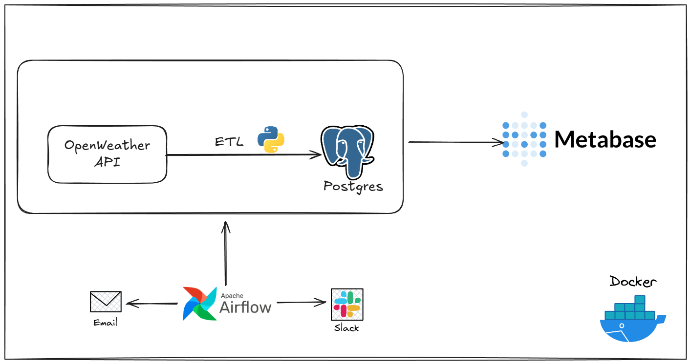

# 🌦️ Weather Data Pipeline  
### ETL Pipeline with Airflow • PostgreSQL • Docker • Metabase

This project is a fully automated **Data Engineering pipeline** that collects real-time weather data from the OpenWeather API, processes it using **Apache Airflow**, stores it in a **PostgreSQL Data Warehouse**, and visualizes insights using **Metabase** dashboards.

The system is built with a production-style architecture and includes:  
**data lake → ETL → DWH → BI → monitoring (Slack + Email)**

---

# 🚀 1. Project Overview

This pipeline processes weather data through the following stages:

### 🔹 **Extract**
- Fetch weather data from OpenWeather API for multiple cities.
- Store raw JSON into a structured **Data Lake**:
  ```
  data/raw/<city>/<yyyy-mm-dd>/<hour>/weather_*.json
  ```

### 🔹 **Transform**
- Parse & clean JSON files.
- Feature engineering:
  - `feels_like_diff`
  - `temp_category`
  - `weather_category`
  - `wind_level`
  - `is_rain`
- Output cleaned **Parquet** files.

### 🔹 **Load**
- Insert transformed data into a **PostgreSQL Data Warehouse** (Star Schema).

### 🔹 **Orchestrate**
- Airflow DAG scheduled hourly (`@hourly`)
- Slack + Email alerts on task failure  
  (Production-ready monitoring)

### 🔹 **Visualize**
- Metabase dashboards for interactive analytics.

---

# 🧱 2. System Architecture



```
                           🌤 OpenWeather API
                                   │
                                   ▼
                     🌀 Apache Airflow (DAG Scheduler)
                       Extract → Transform → Load
                                   │
                     ┌─────────────┴─────────────┐
                     │                           │
           📂 Data Lake (Raw JSON)        📝 Clean Parquet Files
         data/raw/...                     data/clean/...
                     │                           │
                     └─────────────┬─────────────┘
                                   ▼
                         🐘 PostgreSQL Data Warehouse
                         (Star Schema: dim + fact)
                                   │
                                   ▼
                           📊 Metabase Dashboard

```

---

# 📁 3. Project Folder Structure

```
weather_pipeline/
│
├── airflow/
│   ├── dags/
│   │   └── weather_etl_dag.py
│   ├── logs/
│   └── plugins/
│       └── slack_alert.py
│
├── etl/
│   ├── extract/
│   ├── tranform/
│   └── load/
│
├── warehouse/
│   └── schema.sql
│
├── data/
│   ├── raw/
│   └── clean/
│
├── docker-compose.yml
├── .env
└── README.md
```

---

# 🗄 4. Data Warehouse Schema (Star Schema)

### ⭐ Dimensions
- `dim_city`  
- `dim_date`  
- `dim_weather_condition`

### ⭐ Fact Table
- `fact_weather`

### Key Metrics
- `temperature`, `feels_like`, `humidity`, `pressure`
- `wind_speed`, `feels_like_diff`
- `temp_category`, `weather_category`
- `wind_level`, `is_rain`
- `timestamp_utc`

---

# 🐳 5. Running the Project with Docker

## Step 1 — Create `.env`

```
OPENWEATHER_API_KEY=your_api_key_here

# Email Alerts (SMTP)
SMTP_HOST=smtp.gmail.com
SMTP_STARTTLS=True
SMTP_SSL=False
SMTP_USER=your_email@gmail.com
SMTP_PASSWORD=your_app_password
SMTP_PORT=587
SMTP_MAIL_FROM=your_email@gmail.com

# Slack Alerts
SLACK_WEBHOOK_URL=https://hooks.slack.com/services/xxx/yyy/zzz
```

## Step 2 — Start the full platform

```
docker-compose up -d
```

### Exposed Services

| Service | Port | Description |
|--------|------|-------------|
| 🌀 Airflow Webserver | 8085 | DAG UI |
| 🗄 PGAdmin | 8080 | Manage DWH |
| 🐘 PostgreSQL DWH | 5432 | Data Warehouse |
| 📊 Metabase | 3000 | BI Dashboard |

---

# 🌀 6. Airflow DAG Structure

The ETL workflow contains 3 tasks:

1. `extract_task`  
2. `tranform_task`  
3. `load_task`  

Scheduled hourly:

```python
schedule_interval="@hourly"
```

File: `airflow/dags/weather_etl_dag.py`

---

# 🔔 7. Alerting & Monitoring

### 💬 Slack Notifications
Sent when any task fails via incoming webhook.

### 📧 Email Alerts
Configured through Gmail App Password.

### 📝 Enhanced Logging
- number of records processed  
- file paths  
- duration  
- task lifecycle events  

---

# 📊 8. Metabase BI Dashboard

Includes:

- Temperature trend per city  
- Humidity & pressure comparison  
- Weather category distribution  
- Temperature vs humidity scatter plot
  
---

# 🏁 9. Results

This project demonstrates:

- A complete end-to-end Data Engineering pipeline  
- Real-time weather ingestion  
- Production-grade orchestration using Airflow  
- Dimensional DWH modeling  
- Monitoring & alerting (Slack + Email)  
- Dockerized modular architecture  
- Interactive BI dashboards  


